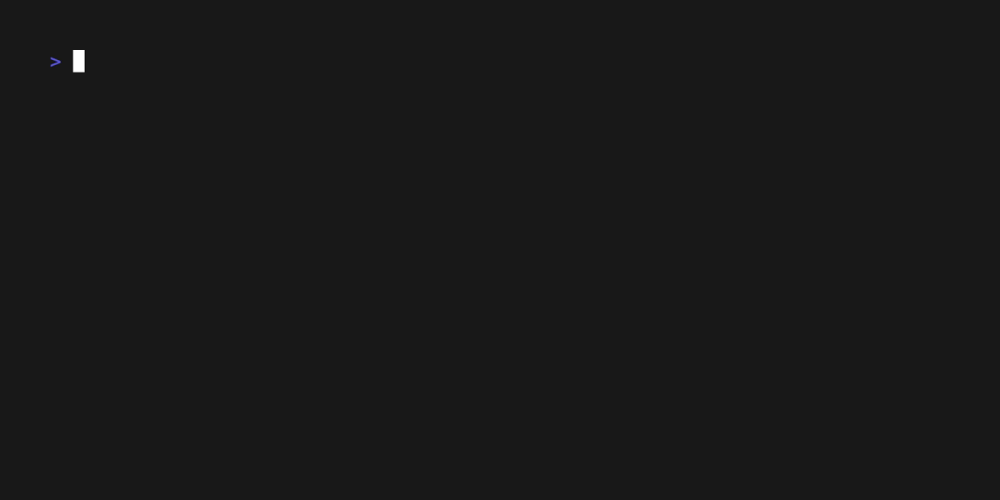

# Kaniko controller

This repository implements a [kaniko](https://github.com/GoogleContainerTools/kaniko) controller for watching OCI image builds
defined with a CustomResourceDefinition (CRD).



## Running

```sh
# assumes you have a working kubeconfig, not required if operating in-cluster
go build -o kaniko-controller .
./kaniko-controller -kubeconfig=$HOME/.kube/config

# create a secret that holds your authorization token
kubectl create secret docker-registry regcred --docker-server=<your-registry-server> --docker-username=<your-name> --docker-password=<your-pword> --docker-email=<your-email>

# create a CustomResourceDefinition
kubectl create -f artifacts/examples/crd.yaml

# create a custom resource of type Image
kubectl create -f artifacts/examples/example-image.yaml

# check the build status with kaniko CRD
kubectl get images.kanikocontroller.autovia.io

# check the pod logs
kubectl logs kaniko-example-image

# pull the image and test
docker run -it <user-name>/<repo-name>
```

### Example

The schema in [`crd.yaml`](./artifacts/examples/crd.yaml) applies the following validation on the custom resource:
`dockerfile` must be a multipline string.

```
apiVersion: kanikocontroller.autovia.io/v1alpha1
kind: Image
metadata:
  name: example-image
spec:
  destination: "<user-name>/<repo>" # replace with your dockerhub account
  dockerfile: |
    FROM ubuntu
    RUN pwd
    RUN ls -l
    ENTRYPOINT ["/bin/bash", "-c", "echo hello"]
```

***Note*** Using the `ADD` or `COPY` feature during image build, the files must be located in the `/workspace` PVC directory.

## Cleanup

You can clean up the kaniko CustomResourceDefinition and related pod with:
```sh
kubectl delete images.kanikocontroller.autovia.io example-image
```

You can clean up the created CustomResourceDefinition with:
```sh
kubectl delete crd images.kanikocontroller.autovia.io
```
